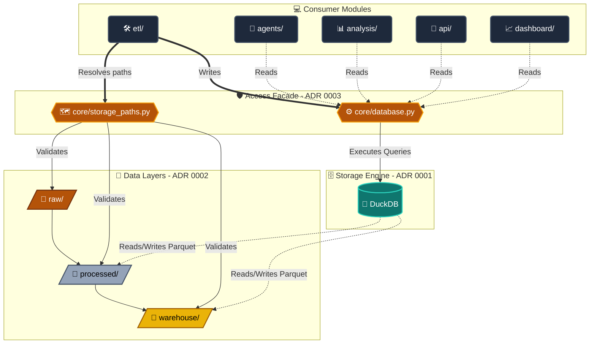

# System Architecture

## Overview

This document provides a high-level view of the AI Data Investigator architecture, consolidating the core structural decisions defined in ADR 0001 (storage engine), ADR 0002 (data layers), and ADR 0003 (data access mediation).

Detailed rationale for each decision is documented in the ADRs. This file focuses on how all components interact as a unified system.

---

## Architecture Diagram

## Layers

### Storage Layer

Defines the physical storage engine used by the system.

- Implemented via DuckDB (ADR 0001)
- Executes analytical queries over local files (CSV/Parquet)
- Acts as the compute engine for the entire system

### Data Organization Layer

Defines how data is structured across lifecycle stages (ADR 0002):

- `raw/` → immutable ingestion snapshots
- `processed/` → cleaned, validated datasets
- `warehouse/` → aggregated analytical data products

This layer ensures reproducibility, auditability, and reprocessing capability.

### Access Layer

Central abstraction layer for all data operations (ADR 0003):

- `core/database.py` → single entrypoint for all DuckDB interactions
- `core/storage_paths.py` → centralized path resolution for data layers

Implements a Facade pattern to prevent direct database access from consumers.

### Consumer Modules

System modules that interact with data:

- `etl/` → ingestion + transformation pipelines (writes data)
- `agents/` → AI reasoning over structured datasets (reads warehouse)
- `analysis/` → statistical and exploratory analysis (reads processed/warehouse)
- `api/` → backend interface exposing system capabilities
- `dashboard/` → visualization layer for human exploration

## Related Decisions

- [ADR 0001](./adr/0001-use-duckdb-as-analytical-database.md) — DuckDB as analytical database engine
- [ADR 0002](./adr/0002-data-layer-structure.md) — Medallion data architecture (raw → processed → warehouse)
- [ADR 0003](./adr/0003-centralize-data-access-through-core-database.md) — Centralized data access through core/database.py (Facade pattern)
